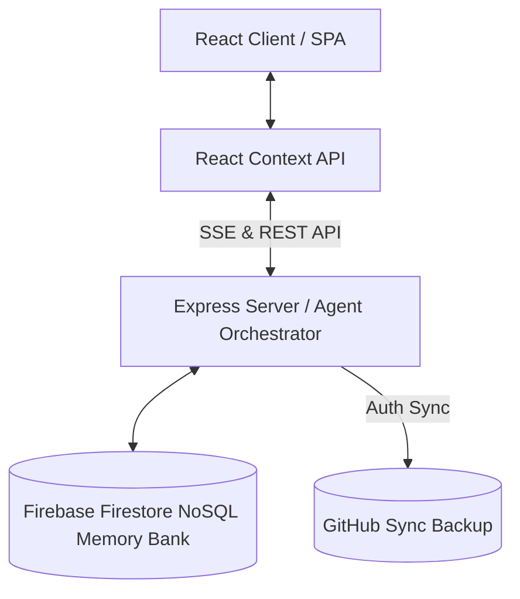
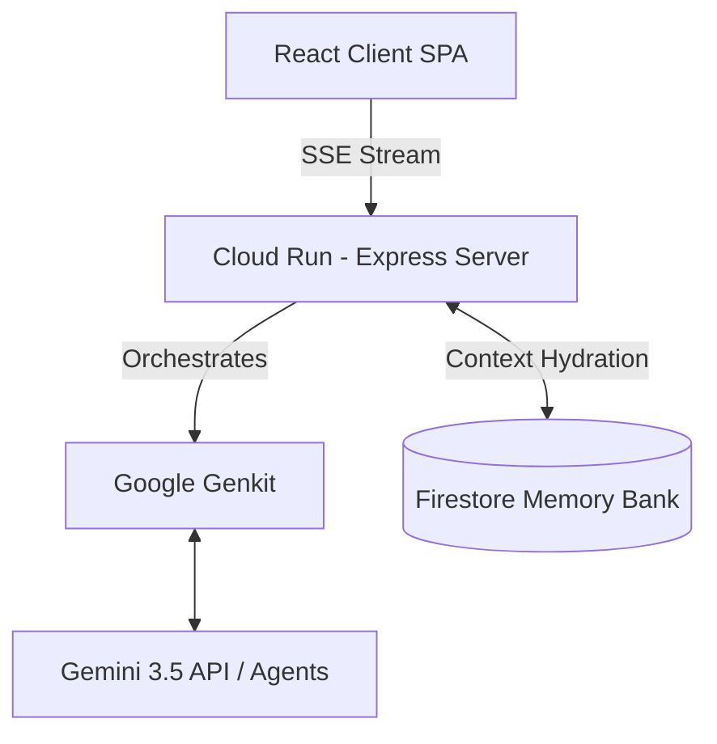
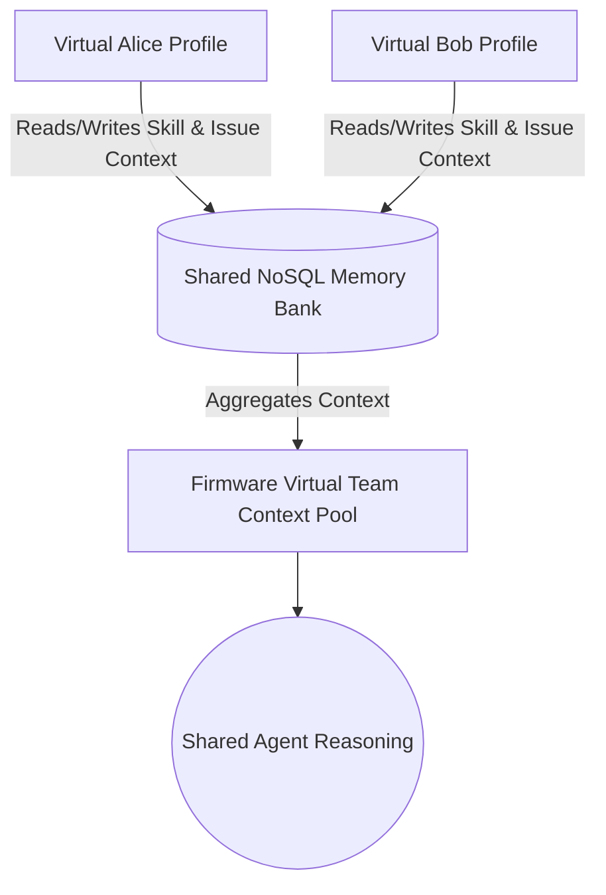

# Virtual Me (VME) Architecture & Implementation Details

The Virtual Me (VME) application is a lightweight full-stack Single Page Application (SPA) built using React, Vite, Tailwind CSS, Node.js, Express, and Firebase Firestore. It serves as a personal developer workspace to manage issues, skills, daily standups, queued jobs (qsub), and session reports.

## Core Architecture

### 1. State Management & Persistence
- **Context API**: The entire application state is managed via React Context (`AppContext.tsx`).
- **NoSQL Memory Bank**: The application uses **Firebase Firestore** via an Express backend to persist workspace data. Firestore serves as the primary "long-term memory" for context retrieval, offering real-time synchronization and schema flexibility for complex agentic workflows.
- **GitHub Sync**: The application can additionally sync its state to a private GitHub repository by authenticating via a Personal Access Token. This acts as a remote backup and version control for the workspace data.

### 2. Frontend Routing & Layout
- A simple tab-based routing system is implemented in `App.tsx`, avoiding the need for heavy routing libraries.
- The layout features a persistent left sidebar (`Sidebar.tsx`) for navigation, and a main content area that renders the selected manager/dashboard component.

### 3. Styling
- **Tailwind CSS**: Used extensively for utility-first styling. 
- **Lucide React**: Provides consistent vector icons across the UI.

## Modules & Features

- **Dashboard**: Displays a high-level overview of active issues, skills, and pending jobs.
- **Workspace (Issues)**: Manages tasks/issues, workflow steps, and context summaries. Allows generating a "Session Report" when a task is completed.
- **Job Queue (qsub)**: Submits agentic workflows (Planner, Executor, QA agents) via SSE streams for real-time task orchestration.
- **Skills & Context**: A repository of acquired skills and reference materials.
- **Daily Standups**: Tracks daily achievements, tomorrow's plans, and current blockers.
- **Blog / Lessons Learned**: A space to document architectural decisions, insights, and session reports.

## Agentic AI Capabilities & Orchestration

The system uses a cloud-native Google Cloud stack to power the multi-agent workflow:

### 1. The Memory Bridge & Context Flow
Virtual Me curates context for daily tasks. Instead of overloading a new session, it pulls from long-term memory (Firestore) to rehydrate the Gemini API's short-term context window. This architecture allows users to perfectly resume historical tasks (e.g., from a year ago) by reconstructing the exact context graph from that point in time.

### 2. Virtual Teams Context Merging
The architecture is designed to scale horizontally across specialized virtual profiles.

Multiple instances can share and merge their underlying context representations via Firestore. This allows for collaborative reasoning where specialized agents (e.g., one optimized for embedded C, another for PCB layout) work off a shared context pool, forming a comprehensive Virtual Team.
