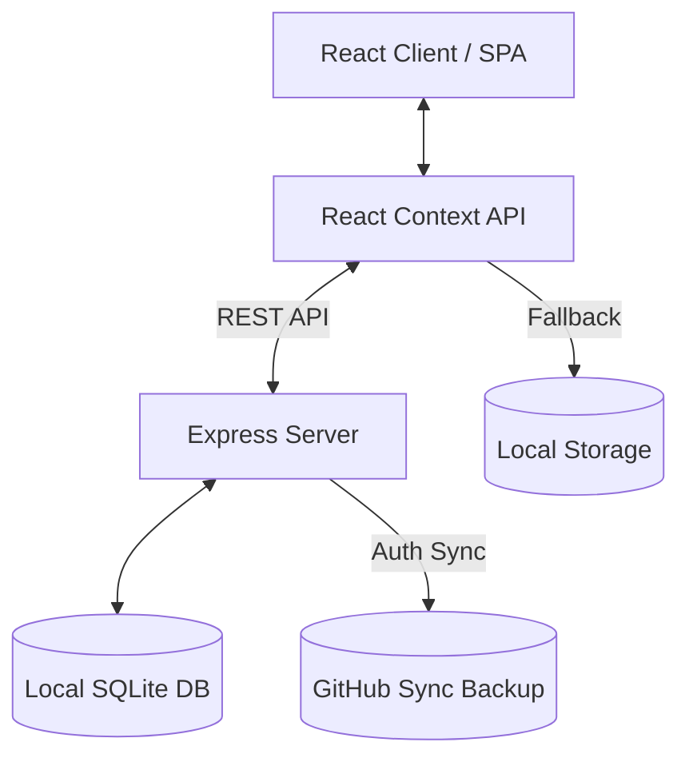
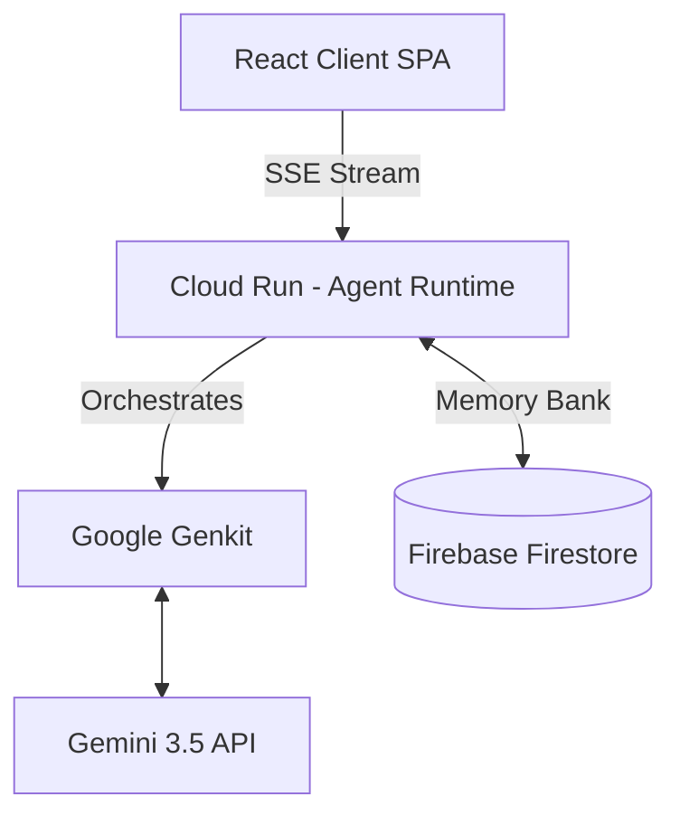

# Virtual Me (VME) Architecture & Implementation Details

The Virtual Me (VME) application is a lightweight full-stack Single Page Application (SPA) built using React, Vite, Tailwind CSS, Node.js, Express, and SQLite. It serves as a personal developer workspace to manage issues, skills, daily standups, queued jobs (qsub), and session reports.

## Core Architecture

### 1. State Management & Persistence
- **Context API**: The entire application state is managed via React Context (`AppContext.tsx`).
- **Local SQLite Database**: The application uses a local SQLite database (`vme.db`) run via an Express backend to persist workspace data. This allows 100% local operation on your machine without relying on external cloud databases, which is ideal for enterprise environments with strict cloud access rules.
- **Local Storage Fallback**: The app continues to sync to `localStorage` as an offline-friendly fallback during development.
- **GitHub Sync**: The application can additionally sync its state to a private GitHub repository by authenticating via a Personal Access Token. This acts as a remote backup and version control for the workspace data.

### 2. Frontend Routing & Layout
- A simple tab-based routing system is implemented in `App.tsx`, avoiding the need for heavy routing libraries.
- The layout features a persistent left sidebar (`Sidebar.tsx`) for navigation, and a main content area that renders the selected manager/dashboard component.

### 3. Styling
- **Tailwind CSS**: Used extensively for utility-first styling. 
- **Lucide React**: Provides consistent vector icons across the UI.

## Modules & Features

- **Dashboard**: Displays a high-level overview of active issues, skills, and pending jobs.
- **Workspace (Issues)**: Manages tasks/issues, workflow steps, and context summaries. Allows generating a "Session Report" when a task is completed.
- **Job Queue (qsub)**: Simulates a job submission system where tasks can be queued, reordered, cancelled, and run with a specific timeout.
- **Skills & Context**: A repository of acquired skills and reference materials.
- **Daily Standups**: Tracks daily achievements, tomorrow's plans, and current blockers.
- **Blog / Lessons Learned**: A space to document architectural decisions, insights, and session reports.

## Planned Architecture (Hackathon Migration)

To support advanced agentic AI capabilities, we are planning a major architectural migration to a cloud-native Google Cloud stack.

### 1. Agentic Job Queue Execution (qsub)
- **Current State (Mocked)**: The job queue execution is simulated using a `setInterval` loop in `AppContext.tsx`.
- **Planned Implementation**: 
  - Migrate execution to the **Agent Development Kit (ADK)** and **Antigravity SDK**.
  - Instead of local shell processes, use **Genkit** to build robust AI-powered workflows.
  - Deploy the agent runtime on **Cloud Run** so the execution engine can scale to zero when idle and scale up seamlessly for heavy jobs.

### 2. State & Persistence Migration
- **Current State**: Uses a local SQLite database (`vme.db`) to store a single JSON blob.
- **Planned Implementation**: 
  - Migrate from SQLite to **Firestore**.
  - Firestore will serve as a NoSQL "Memory Bank" for the agent, providing persistent cross-session context, schema flexibility, and real-time synchronization out-of-the-box.

### 3. AI Capabilities & Orchestration
- **Current State**: Manual or simple API calls.
- **Planned Implementation**:
  - Integrate **Gemini API & Google AI Studio** for core multimodal reasoning and quickstarts.
  - Expose the workspace state (Issues, Skills, Blog) to the ADK agent, transforming the app into a true "Collaborative Partner" that acts as a digital twin.
