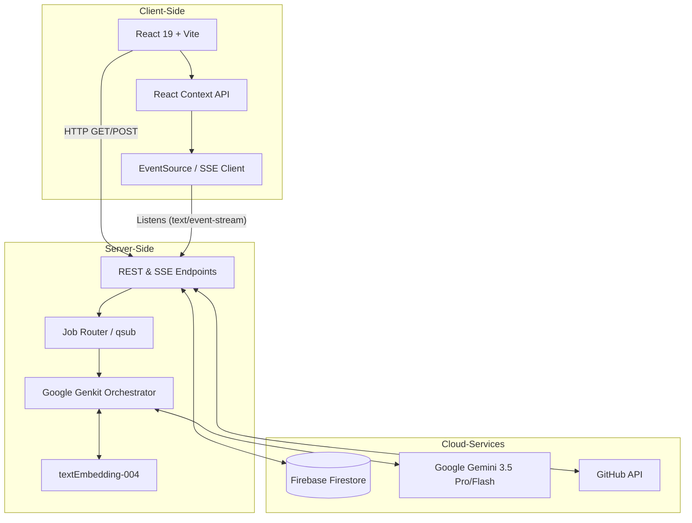

# Virtual Me (vme) Workspace

⏱️ **4-min read** | *Companion to the Hackathon Pitch Video*

**Welcome Judges!** Virtual Me is an AI-powered personal developer workspace designed to streamline workflows, manage large-scale context (optimized for 1M+ token windows), and orchestrate multi-agent execution. 

**🚀 Live Demo:** [virtual-me.ai.studio](https://virtual-me.ai.studio/)

## Features
- **The Extension of Human Memory**: Virtual Me self-improves over time, never forgetting complex knowledge you've acquired (like a college course or mmWave physics). You can "time-travel" debug by effortlessly reloading historical context from a year ago to root-cause a bug introduced at a specific commit.
- **The Memory Bridge**: Align human memory (short/long-term) with AI memory (context windows/skills). Virtual Me optimizes context loading for daily tasks.
- **Session Resumption & Context Flow**: Auto-manage historical AI sessions. Resume a dormant task or project from a year ago seamlessly by rehydrating the exact context state to move it to the next stage.
- **Virtual Teams Collaboration**: Instantiate multiple instances (e.g., Virtual Alice, Virtual Bob) that can merge and share context to form specialized "Virtual Teams" (like a firmware engineering team).
- **Issue & Context Management**: Track bugs and feature requests. Build up the context (logs, code snippets, plans) for each issue sequentially.
- **Skill Manager & Personalized Fine-Tuning**: Virtual Me builds personalized skills daily based on your activity. Through continuous self-evaluation, your Virtual Me gets smarter and better over time—effectively fine-tuning the AI to you as an individual.
- **GitHub Synchronization**: Push and pull your entire context state to your personal GitHub repository, allowing you to resume work across different devices or long periods of time.
- **Token Estimation**: Keep track of your context size to stay within the 1M token limit.
- **Agentic Workflows**: Multi-agent orchestration via SSE stream including Planner, Executor, and QA agents.
- **Clean Minimalism UI**: A focused, distraction-free interface built with React and Tailwind CSS.

## The Future Vision: A Standard for Smart Context
In the long term, Virtual Me aims to be an integral architectural feature of any top-tier AI model (Gemini, ChatGPT, Claude) and a standard extension across AI infrastructure companies. While the foundational AI model acts as the "brain" with a strictly limited context window (e.g., 1M or 2M tokens), utilizing maximum context windows is highly expensive. 

Virtual Me dynamically manages this memory, drastically cutting costs by feeding only the necessary, relevant information into a cheaper **200K "hot token" window** per task. Furthermore, Virtual Me provides effectively **unlimited context scaling**. To put this in perspective: 1 Million tokens uses approximately 4MB of data. By attaching just **10GB of cloud storage**, Virtual Me equips the AI with **2.5 Billion tokens** of persistent memory—seamlessly bridging the gap between finite, expensive token windows and limitless human memory.

## Hackathon Pitch Script (4-Minute Video)

If you'd like to follow along with our submission video, here is the script and workflow we used to demonstrate Virtual Me.

### 1. Introduction (0:00 - 0:30)
*   **Action:** Start on the **Dashboard** tab.
*   **Voiceover:** "Welcome to Virtual Me (VME), an AI-powered personal developer workspace. VME is designed to act as your autonomous coding assistant, managing issues, tracking standups, and running background jobs. It uses a robust Multi-Agent architecture powered by Gemini to automate complex tasks while keeping you in complete control."

### 2. Context & Issues (0:30 - 1:00)
*   **Action:** Click on the **Workspace (Issues)** tab. Show the current issues or create a quick mock issue (e.g., "Refactor database schema"). Click on the **Skills** tab briefly to show existing knowledge.
*   **Voiceover:** "Standard AI models have limited context windows. VME solves this by maintaining long-term memory through Issues, Skills, and persistent logs. This provides our agents with the rich, deep context they need to make intelligent decisions that align perfectly with our specific project's history."

### 3. Multi-Agent Orchestration: The Planner (1:00 - 2:00)
*   **Action:** Go to the **Queue (qsub)** tab. Click the **"Demo: Orchestrate"** button.
*   **Voiceover:** "Let's see the multi-agent system in action. I'm submitting an orchestration job to redesign our database schema. Instead of just blind execution, VME routes this to our **Planner Agent**. The Planner analyzes the request, fetches deep context from our workspace, and formulates a step-by-step execution plan."
*   **Action:** Wait for the plan to stream in. Point out the `Awaiting Approval` status (yellow pulsing icon).
*   **Voiceover:** "Notice that the job is now 'Awaiting Approval'. This is our **Human-in-the-Loop** safety mechanism. As developers, we review the agent's proposed plan before any destructive actions or complex code generation takes place."

### 4. Execution (2:00 - 2:45)
*   **Action:** Click the green **"Approve"** button on the job.
*   **Voiceover:** "Once I approve the plan, the job is handed off to the **Executor Agent**. The Executor takes the exact approved plan and begins generating the code and performing the necessary steps. You can see the logs streaming back in real-time as the agent works autonomously."
*   **Action:** Show the real-time logs updating in the UI.

### 5. Self-Improvement & Personalized Skills (2:45 - 3:30)
*   **Action:** Once the execution is complete, click the **"Run Self-Improvement"** button.
*   **Voiceover:** "What makes VME truly agentic is its ability to learn and fine-tune itself to you as an individual. Every day, the Evaluator Agent reviews your daily activity and execution logs, identifies what went right or wrong, and builds personalized skills."
*   **Action:** Watch the Evaluator generate the JSON. Then navigate to the **Skills** tab.
*   **Voiceover:** "The Evaluator automatically saves these learned skills and memories to the database. Through this continuous self-evaluation, your Virtual Me gets smarter and better over time—creating a highly personalized, fine-tuned context for future execution."

### 6. Conclusion & Future Vision (3:30 - 4:00)
*   **Action:** Switch to the **Blog & Lessons Learned** tab, explicitly highlighting the "Welcome Judges (4-min read)" post which contains the Vision section and Architecture diagram.
*   **Voiceover:** "In summary, Virtual Me automates development safely and continuously improves itself. But our long-term vision is much bigger. Virtual Me is designed to become the global standard for 'Smart Context'—an integral extension to top-tier AI models. If the model is the brain with a limited token window, Virtual Me is the 1000x scale-up of smart context, seamlessly bridging finite tokens with infinite human memory. Thank you for watching!"

## Architecture



## Documentation Directory

We have extensively documented the system, design, and planning of Virtual Me:

- [White Paper](WHITE_PAPER.md) - Deep dive into the philosophy, context management, and system design.
- [Architecture](ARCHITECTURE.md) - Technical architecture, agent orchestration, and state management.
- [Command Line Features](COMMAND_LINE_FEATURES.md) - Reference for the built-in vme terminal commands.
- [Demo Script](DEMO_SCRIPT.md) - Step-by-step script used for the hackathon demo video.
- [Project Plan](PLAN.md) - Initial breakdown of milestones and features.
- [Proposal](PROPOSAL.md) - Original hackathon submission proposal.

## Local Development & Spin-Up Instructions

To run this project locally or deploy it to a Google Cloud Run environment:

1. **Install Dependencies**
   ```bash
   npm install
   ```

2. **Environment Variables**
   Create a `.env` file in the root directory based on `.env.example`:
   ```bash
   GEMINI_API_KEY="your_gemini_api_key"
   ```

3. **Start the Development Server**
   ```bash
   npm run dev
   ```
   The app will be available at `http://localhost:3000`.

4. **Production Build**
   ```bash
   npm run build
   npm start
   ```

## Tech Stack
- React 19
- Vite
- Tailwind CSS v4
- Octokit (GitHub API)
- Firebase (Firestore)
- Express
- Google Genkit & Gemini 3.5 SDK
