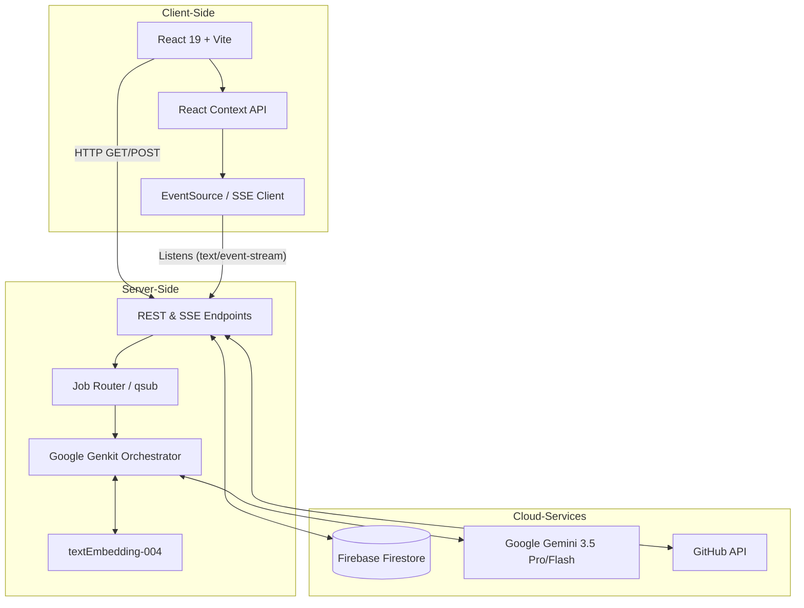

# Virtual Me (vme) Workspace

⏱️ **4-min read** | *Companion to the Hackathon Pitch Video*

**Welcome Judges!** Virtual Me is an AI-powered personal developer workspace designed to streamline workflows, manage large-scale context (optimized for 1M+ token windows), and orchestrate multi-agent execution. 

**🚀 Live Demo:** [virtual-me.ai.studio](https://virtual-me.ai.studio/)

## Features
- **The Extension of Human Memory**: Virtual Me self-improves over time, never forgetting complex knowledge you've acquired (like a college course or mmWave physics). You can "time-travel" debug by effortlessly reloading historical context from a year ago to root-cause a bug introduced at a specific commit.
- **The Memory Bridge**: Align human memory (short/long-term) with AI memory (context windows/skills). Virtual Me optimizes context loading for daily tasks.
- **Session Resumption & Context Flow**: Auto-manage historical AI sessions. Resume a dormant task or project from a year ago seamlessly by rehydrating the exact context state to move it to the next stage.
- **Virtual Teams Collaboration**: Instantiate multiple instances (e.g., Virtual Alice, Virtual Bob) that can merge and share context to form specialized "Virtual Teams" (like a firmware engineering team).
- **Issue & Context Management**: Track bugs and feature requests. Build up the context (logs, code snippets, plans) for each issue sequentially.
- **Skill Manager**: Save reusable prompts, rules, and system instructions (skills) to inject into your Claude or Gemini environment.
- **GitHub Synchronization**: Push and pull your entire context state to your personal GitHub repository, allowing you to resume work across different devices or long periods of time.
- **Token Estimation**: Keep track of your context size to stay within the 1M token limit.
- **Agentic Workflows**: Multi-agent orchestration via SSE stream including Planner, Executor, and QA agents.
- **Clean Minimalism UI**: A focused, distraction-free interface built with React and Tailwind CSS.

## Architecture



## Documentation Directory

We have extensively documented the system, design, and planning of Virtual Me:

- [White Paper](WHITE_PAPER.md) - Deep dive into the philosophy, context management, and system design.
- [Architecture](ARCHITECTURE.md) - Technical architecture, agent orchestration, and state management.
- [Command Line Features](COMMAND_LINE_FEATURES.md) - Reference for the built-in vme terminal commands.
- [Demo Script](DEMO_SCRIPT.md) - Step-by-step script used for the hackathon demo video.
- [Project Plan](PLAN.md) - Initial breakdown of milestones and features.
- [Proposal](PROPOSAL.md) - Original hackathon submission proposal.

## Local Development & Spin-Up Instructions

To run this project locally or deploy it to a Google Cloud Run environment:

1. **Install Dependencies**
   ```bash
   npm install
   ```

2. **Environment Variables**
   Create a `.env` file in the root directory based on `.env.example`:
   ```bash
   GEMINI_API_KEY="your_gemini_api_key"
   ```

3. **Start the Development Server**
   ```bash
   npm run dev
   ```
   The app will be available at `http://localhost:3000`.

4. **Production Build**
   ```bash
   npm run build
   npm start
   ```

## Tech Stack
- React 19
- Vite
- Tailwind CSS v4
- Octokit (GitHub API)
- Firebase (Firestore)
- Express
- Google Genkit & Gemini 3.5 SDK
