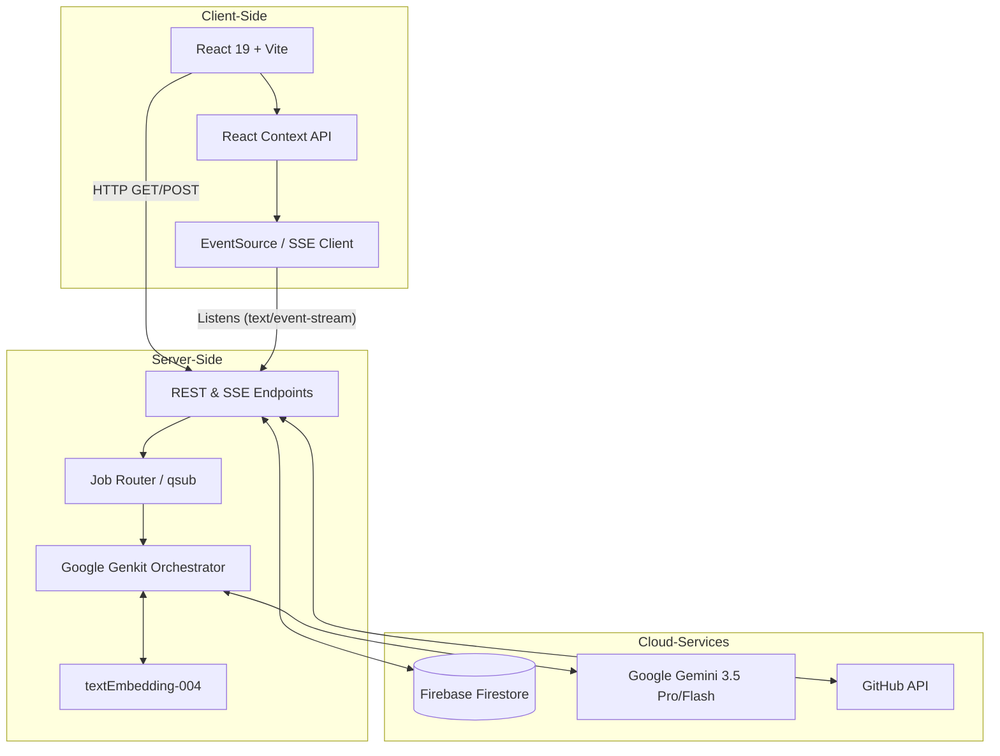
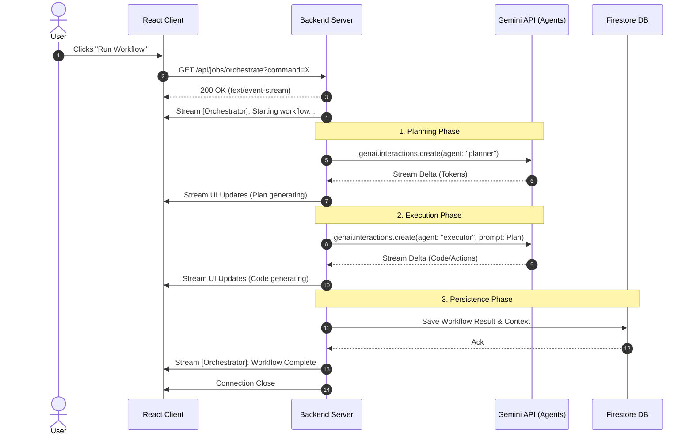
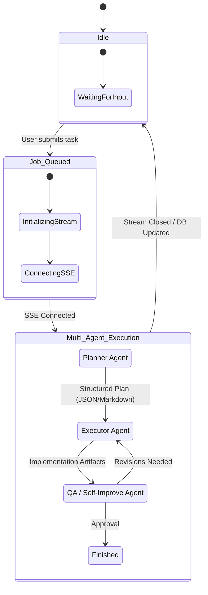
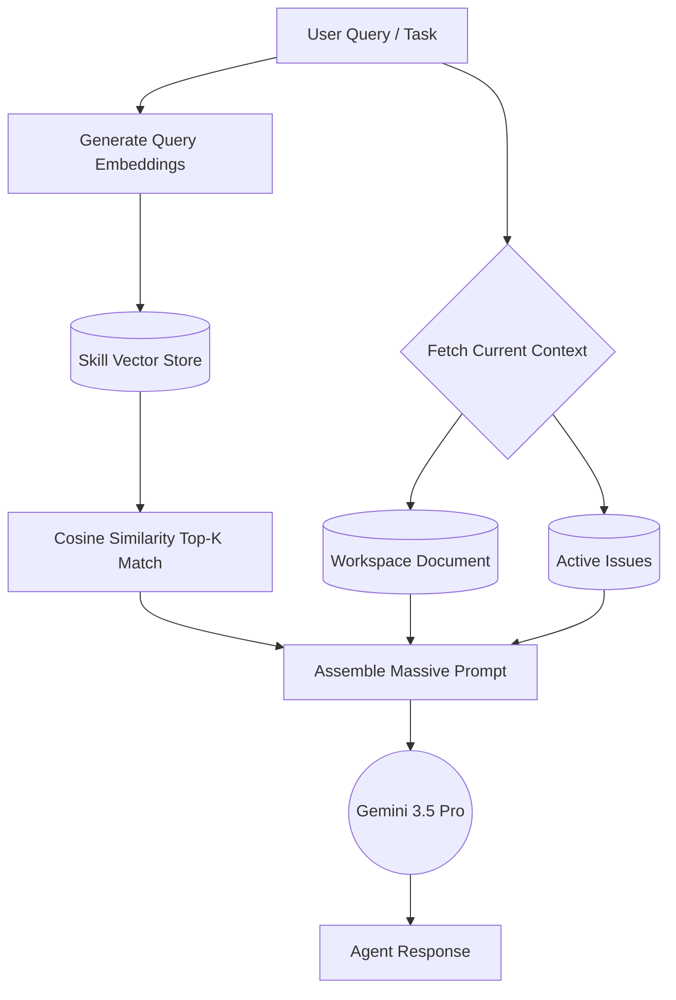

# Virtual Me (vme): An AI-Native Personal Context and Workflow Management System
*A Comprehensive Architecture and Engineering White Paper*

---

## 1. Executive Summary

Modern software development and problem-solving frequently demand the management of massive amounts of context, including system architecture, bug history, codebase snippets, and acquired skills. Current systems—ranging from simple note-taking applications to complex project management tools—struggle to effectively synchronize this context between the human developer and Large Language Models (LLMs). 

**Virtual Me (vme)** addresses this challenge by transitioning the traditional personal workspace into an active, collaborative digital twin capable of planning, executing, and self-improving through agentic workflows. By integrating a full-stack React and Express architecture with Google's Genkit, the Gemini API (Interactions and Agents APIs), and Firebase Firestore, Virtual Me provides a persistent NoSQL Memory Bank and an integrated multi-agent job queue.

### 1.1. The Memory Bridge: Human vs. AI
A core philosophical pillar of Virtual Me is mapping human cognition to AI capabilities:
* **Human Memory:** Humans utilize Short-Term Memory (STM) for active problem-solving and Long-Term Memory (LTM) for accumulated experiences and rules.
* **AI Memory:** Large Language Models (like Claude or Gemini) utilize a Context Window (analogous to STM) for active token processing, and dynamically loaded Skills/System Prompts (analogous to LTM) at runtime.

**Virtual Me acts as the bridge.** It optimizes and curates the exact context needed for daily tasks in a new AI session. Instead of overwhelming the AI with irrelevant data, Virtual Me dynamically rehydrates the AI's "short-term memory" from the human's "long-term memory" (stored in Firestore), creating a perfectly synchronized context flow.

---

## 2. System Architecture Overview

Virtual Me is constructed as a modern, cloud-native full-stack application designed for extremely low latency UI updates and highly reliable long-running AI streaming.

### 2.1. High-Level Architecture Diagram

### 2.2. Tier Breakdown
1. **Frontend Tier**: Built with React 19 and Vite for lightning-fast hot module replacement. Tailwind CSS v4 and Lucide React provide a distraction-free, minimalist user interface.
2. **Backend Orchestration Tier**: An Express Node.js server acts as the central hub. It handles routing, memory retrieval, and agent delegation.
3. **Data & Persistence Layer**: Firebase Firestore serves as a scalable, NoSQL "Memory Bank," providing persistent cross-session context, schema flexibility, and real-time synchronization.

---

## 3. The Orchestration Engine: Deep Dive

One of the most powerful features of Virtual Me is its ability to **orchestrate** complex multi-agent workflows. Rather than sending a single prompt to an LLM, the system queues a job that passes through specialized agents.

### 3.1. How "Orchestrate" Works (Demo Flow)

When a user submits a command via the UI (e.g., *"Build a new authentication flow"*), the following sequence occurs:

1. **Job Initialization**: The React UI enqueues a job and opens an `EventSource` connection to `/api/jobs/orchestrate?command=...`.
2. **SSE Handshake**: The Express server immediately responds with headers `Content-Type: text/event-stream` and `X-Accel-Buffering: no`, ensuring the HTTP connection remains open for streaming real-time tokens.
3. **Planner Agent Invocation**: The backend uses the `GoogleGenAI` Interactions API to summon the Planner Agent. The planner breaks the task into deterministic steps.
4. **Executor Handoff**: Once the plan is generated, it is passed to the Executor Agent, which generates the actual code or modifies the workspace state.
5. **Continuous Streaming**: Throughout this process, every token, status update, and agent thought-process is yielded back to the Express response stream using `res.write()`.

### 3.2. Orchestration Sequence Diagram

---

## 4. Multi-Agent Job Lifecycle and Flow

The application doesn't just pass text; it manages state transitions between AI personas.

### 4.1. Workflow Diagram

### 4.2. Agent Roles
- **Planner Agent**: Analyzes complex tasks and breaks them down into actionable, sequential steps. It anticipates dependencies and edge cases.
- **Executor Agent**: The "doer." Takes the structured plan and performs the necessary implementation, script generation, or API calls.
- **QA / Self-Improve Agent**: An adversarial agent that evaluates the Executor's output for quality, correctness, and adherence to user-defined rules.

---

## 5. Memory, Context, and RAG (Retrieval-Augmented Generation)

To effectively manage 1M+ token windows, Virtual Me employs a sophisticated RAG architecture combined with explicit Skill management and deep session state restoration.

### 5.1. Context Assembly Flowchart

### 5.2. Skill Management
The "Skill Manager" saves reusable prompts, architectural rules, and system instructions. Through vector embeddings (using `textEmbedding004`), the system dynamically retrieves relevant skills based on the current context, ensuring the AI agent adheres to the developer's specific coding guidelines without permanently bloating the system prompt.

### 5.3. Session Resumption and Context Flow
One of the most challenging aspects of human cognition is picking up a dormant project. Virtual Me automatically manages all historical AI sessions. If a user needs to return to a task they started a year ago, Virtual Me locates the exact context graph from that time, rehydrates the AI session, and perfectly resumes the "context flow." This allows the human and the AI to instantly pick up the old task and move it forward to the next stage without losing any nuance.

### 5.4. Virtual Teams & Context Merging
The architecture of Virtual Me is not limited to a single individual. By instantiating multiple, specialized "Virtual Me" profiles (e.g., *Virtual Alice* specializing in embedded C, and *Virtual Bob* specializing in PCB design), users can build entirely virtual development groups. 

Because context in Virtual Me is structured as a graph in the NoSQL Memory Bank, Virtual Alice and Virtual Bob can share, merge, and diff their contexts. This enables the formation of a **Firmware Virtual Team**, where agents collaboratively reason over a shared, optimized context pool.

### 5.5. Continuous Self-Improvement and the Extension of Human Memory
Virtual Me is designed to **self-improve over time**, serving as an infallible extension of your own memory. While a human might learn a complex subject—such as a college student mastering a semester-long course or a firmware engineer researching mmWave physics for an in-cabin radar child detection feature—that deep, specialized knowledge naturally fades over time. **Virtual Me never forgets.**

By continuously recording the nuances, failed attempts, and acquired skills of long-term projects, Virtual Me acts as a searchable extension of your cognition:
1. **Deep Subject Mastery:** It preserves the in-depth knowledge of niche fields you've explored, ready to be instantiated as a specialized skill whenever you return to that domain.
2. **"Time-Travel" Debugging:** If an engineer introduces a subtle bug while implementing a feature (like the mmWave radar), and the failure only surfaces in production a year later, Virtual Me can search through its deep history of context. It can accurately correlate the failure to the exact thought process, code change, commit, and time where the bug was introduced, effortlessly reloading that exact historical context to help you root-cause the issue.

---

## 6. Infrastructure & Deployment Details

### 6.1. Real-time Streaming & Server-Sent Events (SSE)
Unlike traditional REST APIs that timeout after 30-60 seconds, or WebSockets which require complex bi-directional state management, Virtual Me leverages **Server-Sent Events (SSE)**. 
- `X-Accel-Buffering: no` ensures that reverse proxies (like Nginx) do not buffer the AI's token stream, delivering a typing-like experience directly to the React frontend.
- `Connection: keep-alive` prevents premature termination during deep-thinking phases of the Planner Agent.

### 6.2. Firebase Firestore as the NoSQL Memory Bank
The decision to build on Firebase Firestore as the underlying memory store was driven by:
1. **Concurrency**: Multiple agents can read/write to the workspace state simultaneously without locking the database.
2. **Real-time Listeners**: React can natively subscribe to Firestore snapshot changes, ensuring the UI reflects the backend state instantly even if the browser is refreshed mid-job.
3. **Context Sharing & Merging**: As a cloud NoSQL store, Firestore natively enables the Virtual Teams architecture, allowing isolated agent profiles (like Alice and Bob) to securely query and merge their contexts into a shared team pool.

### 6.3. GitHub Synchronization
Virtual Me maintains the ability to push and pull the workspace state to a personal GitHub repository, providing an additional layer of version control and cross-device synchronization via the `Octokit` API.

---

## 7. Future Roadmap and Conclusion

Virtual Me represents the next generation of personal developer workspaces. By treating the workspace not as a static repository of files, but as a living, breathing context environment monitored by autonomous agents, developers can tackle significantly larger cognitive loads.

**Upcoming Features:**
- **Local LLM Fallback**: Integration with Ollama for offline, localized agent execution.
- **Expanded Tool Integrations**: Giving the Executor Agent direct file-system access (read/write) within sandboxed Docker containers.
- **Agentic Memory Compaction**: Background jobs that periodically summarize and compress historical issues into dense vector embeddings to preserve the primary context window.

By fusing a structured task and context manager with powerful, autonomous AI agents, Virtual Me evolves beyond a simple to-do list or wiki. It acts as a localized digital twin, actively assisting in planning, executing, and documenting workflows.
